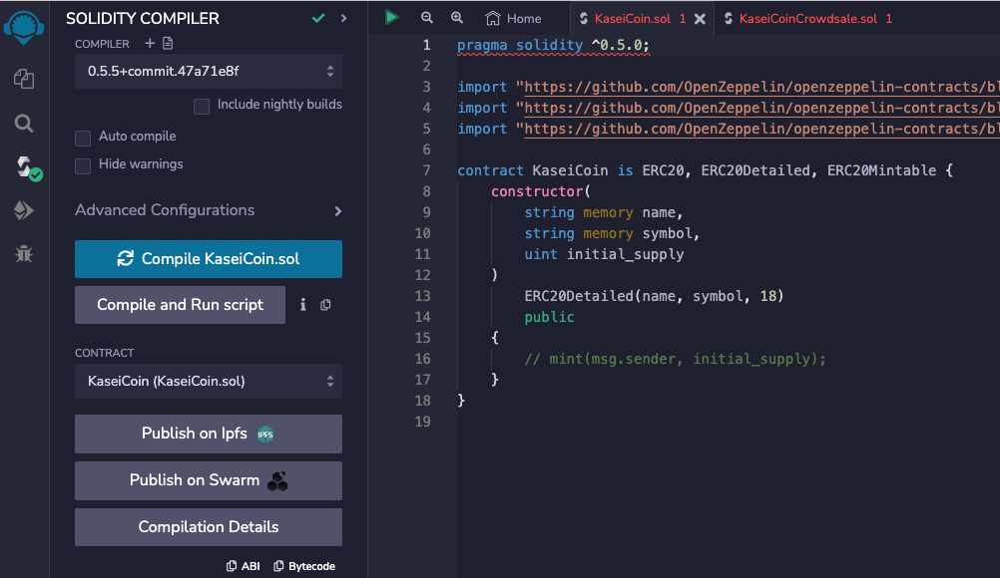
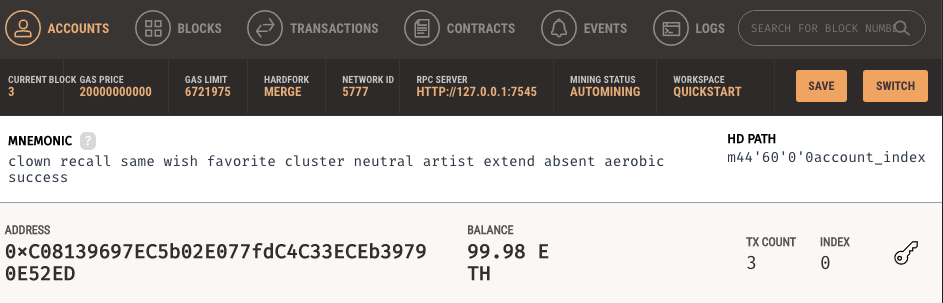

# KaseiCoin Token

## Background

After waiting for years and passing several tests, the Martian Aerospace Agency selected me to become part of the first human colony on Mars. As a prominent fintech professional, they chose me to lead a project developing a monetary system for the new Mars colony. I decided to base this new system on blockchain technology and to define a new cryptocurrency named **KaseiCoin**. (Kasei meaning Mars in Japanese)

KaseiCoin will be a fungible token that’s ERC-20 compliant. I will launch a crowdsale that will allow people who are moving to Mars to convert their earthling money to KaseiCoin.

## Create the KaseiCoin Token Contract

## Create the KaseiCoin Crowdsale and Deployer Contract

## Deploy and Test the Crowdsale on a Local Blockchain

### 1. Deploy the crowdsale to a local blockchain by using Remix, MetaMask, and Ganache.

  - In addition to the crowdsale account, two other test accounts are connected to MetaMask and Remix to test functionality

   - Deployment of Deployer contract
   

   - Deployment of Crowdsale contract
    

   - Deployment of KaseiCoin Token contract

   - Confirmation from Ganache of the deployed contract

### 2. Test the functionality of the crowdsale by using test accounts to buy new tokens and then checking the balances of those accounts.

   - In Test Account 1 we spent 20 ETH

   - In Test Account 2 we spent 10 ETH

### 3. Review the total supply of minted tokens and the amount of wei that the crowdsale contract has raised.

   - In Ganache accounts balances, we can see Crowdsale account (first account) received Ethers after the 2 transactions from Test Account 1 (second account) for 20 ETH and from Test Account 2 (third account) for 10 ETH.

   - Under Crowdsale contract, we can see weiRaised is 30 ETH in Wei
   

   - Under KaseiCoin contract, we can see totalSupply is 30 ETH in Wei

